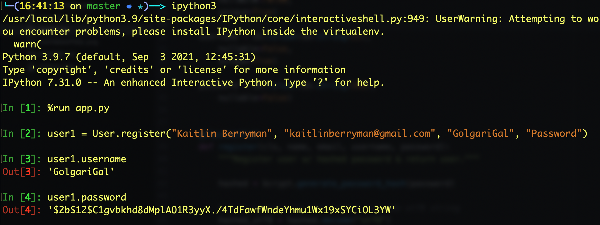

# Hashing and Login - Flask Feedback

In this exercise, we’ll be creating an application that lets users sign up and log in to their own accounts. Once logged in, users can add feedback, edit their feedback, delete their feedback, and see a list of all feedback that they’ve given. Many of these routes should be protected, so that for example  _user1_  can’t edit a piece of feedback that  _user2_  created. (More on this below.)

## Part 0: Set up your environment

You know the drill. Make a venv, pip install all the things, put your code on GitHub, etc.

### Creating a new Flask App

-   Create a new virtual environment in my directory  `python3 -m venv env`
-   Activate the virtual environment  `source env/bin/activate`
-   Install Flask  `pip3 install Flask`
-   Create  `flask/`  folder and  `app.py`  in there
-   Add boilerplate code
```
"""test Flask with this"""

from flask import Flask
app = Flask(__name__)

@app.route('/')
def hello():
    return 'Hello World!'
```

-   `cd flask`
-  `flask run`  to run this locally on localhost:5000

---

### Setting up git & GitHub
`git init`
`git status`
Create a `.gitignore` and include `__pycache__`
`git add .`
`git commit -m "Initial commit"`

Create a new repo on GitHub
`git remote add origin https://github.com/k-berryman/Magic-Dashboard.git`
`git remote -v`
`git push origin master`

---

## Part 1: Create User Model

First, create a  User  model for SQLAlchemy. Put this in a  models.py  file.

It should have the following columns:

-   username  - a unique primary key that is no longer than 20 characters.
-   password  - a not-nullable column that is text
-   email  - a not-nullable column that is unique and no longer than 50 characters.
-   first_name  - a not-nullable column that is no longer than 30 characters.
-   last_name  - a not-nullable column that is no longer than 30 characters.


### Creating Models
- Create `models.py` and add some boilerplate code
```
"""Models for app."""

from flask_sqlalchemy import SQLAlchemy

db = SQLAlchemy()


class TABLENAME(db.Model):
    """TABLENAME."""

    __tablename__ = "TABLENAME"

    id = db.Column(db.Integer,
                   primary_key=True,
                   autoincrement=True)

    name = db.Column(db.String(150),
                     nullable=False)

    description = db.Column(db.String(300),
                     nullable=False)
```

- Update the data to match the given schema

---

## Part 2: Make a Base Template

Add a base template with slots for the page title and content. Your other templates should use this.

You can use Bootstrap for this project, but don’t spend a lot of time worrying about styling — this is  **not**  a goal of this exercise.

- Make `templates` folder and `base.html` in there and add this boilerplate
```
<!DOCTYPE html>
<html lang="en">
<head>
  <meta charset="UTF-8">
  <meta name="viewport" content="width=device-width, initial-scale=1.0">
  <meta http-equiv="X-UA-Compatible" content="ie=edge">
  <title>Document</title>
  <link rel="stylesheet" href="https://stackpath.bootstrapcdn.com/bootswatch/4.1.3/lumen/bootstrap.css">
</head>
<body>
  <div class="container">
    
    
  </div>
</body>
</html>
```

Create `home.html` with this boilerplate
```




<h1>Home Page</h1>
<h2>Hello, user!</h2>


```

In `app.py`, import `render_template` and `return render_template("home.html")`

---

## Part 3: Make Routes For Users

Make routes for the following:

**GET  /**
Redirect to /register.

> - import `redirect`
```
@app.route('/')
def home():
    return redirect('/register')
```

---

### Setting up WTForms
-   `pip3 install Flask-WTF`
-   `pip3 install flask-wtf`  just to double check
-   Create  `forms.py`
-   Add the following imports in  `forms.py`

```
from flask_wtf import FlaskForm
from wtforms import FloatField, StringField
```

- Add boilerplate
```
class RegisterForm(FlaskForm):
    """Register Form"""

    name = StringField("First Name")
    Description = StringField("Description")
```

-   In  `app.py`,  `from forms import RegisterForm`

Start by rendering the  `PlaylistForm`  to the user which can be submitted via POST req

-   In  `app.py`,
```
@app.route("/register", methods=["GET", "POST"])
def register():
    form = RegisterForm()
    return render_template("register.html", form=form)
```

-   Go to  `templates/`  and create `register.html`. Add the boilerplate
```




<form action="" method="POST">
    
      <p>
        {{ field.label }}
        {{ field }}
      </p>
    
    <button>Submit</button>
</form>


```

Now let's handle CSRF security
- This part  `if field.widget.input_type != 'hidden'`  filters out CSRF Token in display
- In  `register.html`  At the top of the form add  `{{ form.hidden_tag() }} <!-- add type=hidden form fields -->`  Make sure it's part of the form because we want it to be included in our POST req
- Now we need to validate that token on the serverside. In `app.py`,
```
form = RegisterForm()

if form.validate_on_submit():
    return redirect('/success')

else:
    return render_template("register.html", form=form)
```

- `validate_on_submit`  takes an empty form and fills it with data from the request. Let's get our data!
```
    # if it's a post request with a valid CSRF Token
    if form.validate_on_submit():
        name = form.name.data
        description = form.description.data
        print(name, description)
        return redirect('/success')
```

Time to validate the data
- Throw friendly errors if it doesn't match ideal data format In `forms.py`, `from wtforms.validators import InputRequired`. Update the following.
```
name = StringField("Playlist Name", validators=[InputRequired()])
description = StringField("Playlist Description", validators=[InputRequired()])
```

`validate _on_submit`  in  `app.py`  handles validating this

We want some error messages to render In  `register.html`

```




<form action="" method="POST">
    {{ form.hidden_tag() }} <!-- add type=hidden form fields -->
    
      <p>
        {{ field.label }}
        {{ field }}

        
          {{err}}
        
      </p>
    
    <button>Submit</button>
</form>


```

- A secret key is required, so add it in `app.py` `app.config['SECRET_KEY'] =  "I'LL NEVER TELL!!"`

---

**GET  /register**
Show a form that when submitted will register/create a user. This form should accept a username, password, email, first_name, and last_name. Make sure you are using WTForms and that your password input hides the characters that the user is typing!

> Update `forms.py` to match prompt's inputs

# ERROR DEBUGGING HERE
I kept getting `Exception: Install 'email_validator' for email validation support` no matter what I tried. When getting weird errors, just deactivate and reactivate my virtualenv. That worked.
--

> Add in  `Length`  check to make sure the inputs aren't too long. In  `forms.py`,
```
from flask_wtf import FlaskForm
from wtforms import FloatField, StringField
from wtforms.validators import InputRequired, Email, Length
from wtforms.fields import PasswordField

class RegisterForm(FlaskForm):
    """Register Form"""

    username = StringField("Username",
        validators=[
            InputRequired("Username can't be blank"),
            Length(min=1, max=20, message="Username must be 20 characters or less")])

    password = PasswordField("Password", validators=[InputRequired("Password can't be blank")])

    email = StringField("Email",
        validators=[
            InputRequired("Email can't be blank"),
            Email("Please enter a valid email"),
            Length(min=1, max=50, message="Email must be 50 characters or less")])

    first_name = StringField("First Name",
        validators=[
            InputRequired("First name can't be blank"),
            Length(min=1, max=30, message="First name must be 30 characters or less")])

    last_name = StringField("Last Name",
        validators=[
            InputRequired("Last name can't be blank"),
            Length(min=1, max=30, message="Last name must be 30 characters or less")])
```

Update view function in `app.py`
```
    # if it's a request with a valid CSRF Token
    if form.validate_on_submit():
        # retrieve data from form
        username = form.username.data
        password = form.password.data
        email = form.email.data
        first_name = form.first_name.data
        last_name = form.last_name.data

        # add to SQLAlchemy
        user = User(username=username, password=password, email=email, first_name=first_name, last_name=last_name)
        db.session.add(user)
        db.session.commit()

        # redirect
        return redirect('/success')
```

**POST  /register**
Process the registration form by adding a new user. Then redirect to  /secret
> See above. Just change the redirect to /secret

**GET  /login**
Show a form that when submitted will login a user. This form should accept a username and a password. Make sure you are using WTForms and that your password input hides the characters that the user is typing!

**POST  /login**
Process the login form, ensuring the user is authenticated and going to  /secret  if so.

> Make LoginForm in `forms.py`
> Make `login.html` based on `register.html`

```
from forms import RegisterForm, LoginForm
...

@app.route('/login', methods=["GET", "POST"])
def login():
    form = LoginForm()

    # if it's a request with a valid CSRF Token
    if form.validate_on_submit():
        # retrieve data from form
        username = form.username.data
        password = form.password.data

        # verification...?

        # redirect
        return redirect('/secret')

    else:
        return render_template("login.html", form=form)
```


**GET  /secret**
Return the text “You made it!” (don’t worry, we’ll get rid of this soon)


---
The above is done besides authenticating the user

# EDIT - DO NOT STORE PASSWORDS DIRECTLY - FOLLOW BELOW

We need to hash them with Bcrypt

Here are the notes -- NOT THE STEPS

> `pip3 install Flask-Bcrypt` ``` from flask_bcrypt import Bcrypt
>
> bcrypt = Bcrypt()
>
> hash = bycrypt.generate_password_hash(user_password) ```
>
> It generates a random salt each time. It stores the salt in the hash
> store hash in db
>
> Logging in? ``` bcrypt.check_password_hash(hash, USER_FROM_INPUT) ```
> returns True or False
>
> Steps
> 1. When a user signs up, take their password
> 2. `hash = bycrypt.generate_password_hash(password)` with the password from above
> 3. Store the hash in our database
> 4. When they go to log in, they type a username and password
> 5. We take the username and find the correct user in our database and the hash associated with it
> 6.  `bcrypt.check_password_hash(hash, USER_FROM_INPUT)` with the first input being from our database and the second input being from the log
> in form
> 7. If the above line returns True, we can log them in
>
> It will remember that we're logged in
>
> Logic won't be in the view function. It'll be in the models using
> class methods under User model. 2 class methods -- register &
> authenticate -- for signing up and logging in. If authentication
> works, return the user itself.
>
> How do we keep someone logged in? User Sessions Showing different
> content based on login status Store their `user_id` in the session
> `session["user_id"] = user.id   # keep logged in` Check in view
> functions and templates can also have logic Associate comments  (or
> any model they're creating)  with user through session user id To log
> out, remove user_id from session `session.pop("user_id")

**HERE ARE THE STEPS**
`pip3 install flask_sqlalchemy`
In `models.py`, `from flask_bcrypt import Bcrypt`

Here's our current `models.py`
```
from flask_sqlalchemy import SQLAlchemy
from flask_bcrypt import Bcrypt

db = SQLAlchemy()

def connect_db(app):
    """Connect to database."""

    db.app = app
    db.init_app(app)

class User(db.Model):
    """User."""

    __tablename__ = "users"

    username = db.Column(db.String(20),
                   primary_key=True,
                   unique=True)

    password = db.Column(db.String(50),
                     nullable=False)

    email = db.Column(db.String(50),
                     nullable=False,
                     unique=True)

    first_name = db.Column(db.String(30),
                     nullable=False)

    last_name = db.Column(db.String(30),
                     nullable=False)

```

In `app.py`, `from models import connect_db, db, User`

In terminal, `createdb hashing_exercise`
`ipython3`
`%run app.py`
`db.create_all()`


`psql`
`\c hashing_exercise`
`SELECT * FROM users;`


In `app.py`,
```
app.config['SQLALCHEMY_DATABASE_URI'] = 'postgresql:///hashing_exercise'
app.config['SQLALCHEMY_TRACK_MODIFICATIONS'] = False
app.config['SQLALCHEMY_ECHO'] = True

connect_db(app)
```

`pip3 install flask_bcrypt`

In `models.py` in `User` model,
`from flask_bcrypt import Bcrypt`
`bcrypt = Bcrypt()`
```
    @classmethod
    def register(cls, username, password):
        """Register user w/ hashed password & return user."""

        hashed = bcrypt.generate_password_hash(password)

        # turn bytestring into normal unicode utf8 string
        hashed_utf8 = hashed.decode("utf8")

        # return instance of user w/ username and hashed password
        return cls(username=username, password=hashed_utf8)
```

It works!


Now let's add our authenticate class method
```
    @classmethod
    def authenticate(cls, username, password):
        """Validate that user exists and password is correct.
        Return user if valid; else, return False
        """

        u = User.query.filter_by(username=username).first()

        if u and bcrypt.check_password_hash(u.password, password):
            return u
        else:
            return False
```

`pip3 install psycopg2`
see commits

Register view function
```
@app.route("/register", methods=["GET", "POST"])
def register():
    form = RegisterForm()

    # if it's a request with a valid CSRF Token
    if form.validate_on_submit():
        # retrieve data from form
        username = form.username.data
        password = form.password.data
        email = form.email.data
        first_name = form.first_name.data
        last_name = form.last_name.data

        # add to SQLAlchemy
        new_user = User.register(username, password, email, first_name, last_name)
        db.session.add(new_user)
        db.session.commit()

        # redirect
        flash('Welcome! Successfully created your account!')
        return redirect('/secret')

    else:
        return render_template("register.html", form=form)
```

Login view function
```
@app.route('/login', methods=["GET", "POST"])
def login():
    form = LoginForm()

    # if it's a request with a valid CSRF Token
    if form.validate_on_submit():
        # retrieve data from form
        username = form.username.data
        password = form.password.data

        # verification
        user = User.authenticate(username, password)
        if user:
            # redirect
            return redirect('/secret')
        else:
            form.username.errors = ['Invalid username/password']

    return render_template("login.html", form=form)
```

----

## Part 4: Don’t let everyone go to  /secret

Despite all of this wonderful password hashing that you have been doing, anyone can navigate to  /secret  and see the text “You made it!”. Let’s protect this route and make sure that only users who have logged in can access this route!

To do that, we’re going to make sure that when we log a user in (and after they register), we store just a little information in the session. When the user successfully registers or logs in, store the  username  in the session.

In `app.py`,
```
@app.route('/secret')
def secret():
    if "user_username"not in session:
        flash('Please login first!')
        return redirect('/')
    return "You made it!"
```

In login view func,
```
# add user_id to session
session['user_username'] = user.username

```

In register view func,
```
# add user_id to session
session['user_username'] = new_user.username
```

## Part 5: Log out users

Make routes for the following:

GET  /logout

Clear any information from the session and redirect to  /
```
@app.route('/logout')
def logout():
    session.pop('user_username')
    flash('Goodbye! logging out now..')
    return redirect('/')
```
Could make this a post request by styling an empty form on top of UI Logout. Post req is best practice.

---


## Part 6: Let’s change  /secret  to  /users/<username>

Now that we have some logging in and and logging out working. Let’s add some authorization! When a user logs in, take them to the following route:

`GET  /users/<username>`

Display a template the shows information about that user (everything except for their password). You should ensure that only logged in users can access this page.

> Change secrets route name
> Make userInfo.html
> Pass user into userInfo.html

```
@app.route('/users/<username>')
def secret(username):
    if "user_username"not in session:
        flash('Please login first!')
        return redirect('/')
    u = User.query.filter_by(username=username).first()
    return render_template("userInfo.html", user=u)
```

---

## Part 7: Give us some more feedback!

It’s time to add another model.

Create a  Feedback  model for SQLAlchemy. Put this in a  models.py  file.

It should have the following columns:

-   id  - a unique primary key that is an auto incrementing integer
-   title  - a not-nullable column that is at most 100 characters
-   content  - a not-nullable column that is text
-   username  - a foreign key that references the username column in the users table
```
class FeedbackComment(db.Model):
    __tablename__ = "feedbackComments"

    id = db.Column(db.Integer, primary_key=True,autoincrement=True)
    title = db.Column(db.String(100), nullable=False)
    content = db.Column(db.String(750), nullable=False)
    username = db.Column(db.String(500), db.ForeignKey('users.username'))

    user = db.relationship('User', backref="feedbackComments")
```

ipython3
`%run app.py`
`db.create_all()`
`User.query.all()`
`comment = FeedbackComment(title="First Post", content="Enjoy my first post!", username="kaitlin")`
`db.session.add(comment)`
`db.session.commit()`
`comment.title`
`comment.username`
`comment.user`
`comment.user.email`
`user = comment.user`
`user.feedbackComments`

Make a new feedbackCommentForm in `forms.py`
```
class feedbackCommentForm(FlaskForm):
      title = StringField("Feedback Title", validators=[InputRequired("Input can't be blank")])
      content = StringField("Content Title", validators=[InputRequired("Input can't be blank")])
```

Create comments.html

---

Now let's display current comments

----

### Only delete a comment you've created

We're going to make a form to have something to click on to delete the post which sends a post request

In `comments.html`
```
  
    <li>
      <b>{{ comment.user.username }}</b> - {{ comment.title }} - {{ comment.content }}
      
      <form action="/comments/delete">
        <button>Delete</button>
      </form>
      
    </li>
  
```
The delete button only shows up for logged in users matched comments

We'll check in our view function too


Update comment.html `<form action="/comments/{{comment.username}}/delete" method="POST">`

```
@app.route('/comments/<string:username>/delete', methods=["POST"])
def delete_comment(username):
    comment = FeedbackComment.query.filter_by(username=username).first()

    if comment.username == session["user_username"]:
        db.session.delete(comment)
        db.session.commit()
        flash('Comment deleted')
        return redirect('/feedbackComments')

    flash('You need permission to delete')
    return redirect('/feedbackComments')
```
