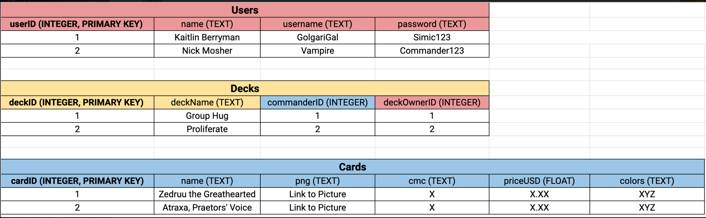
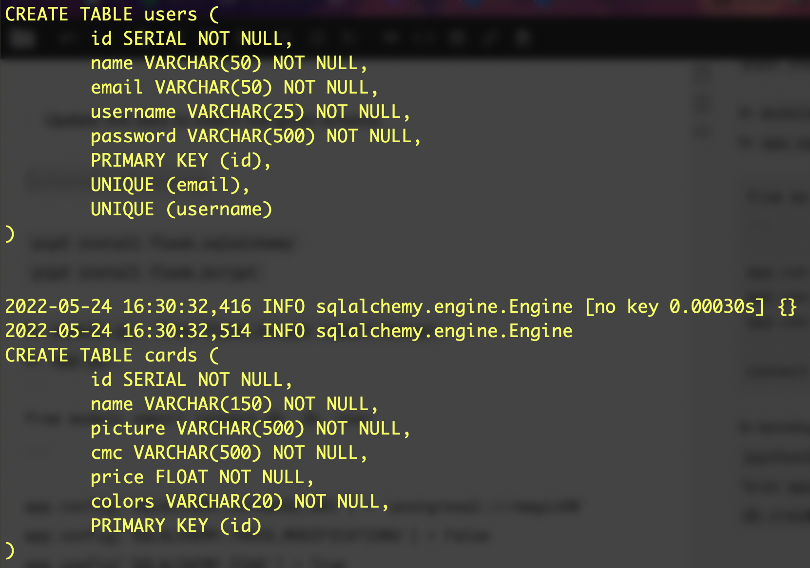
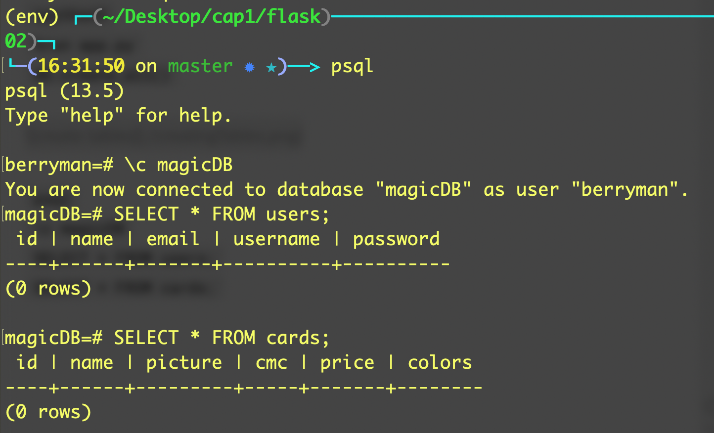
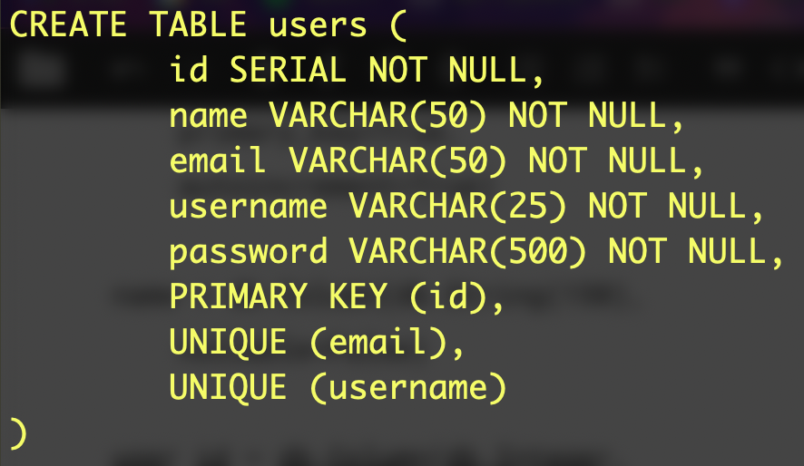
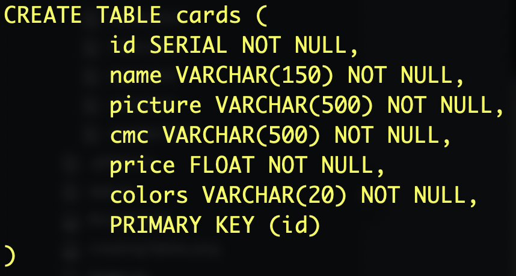
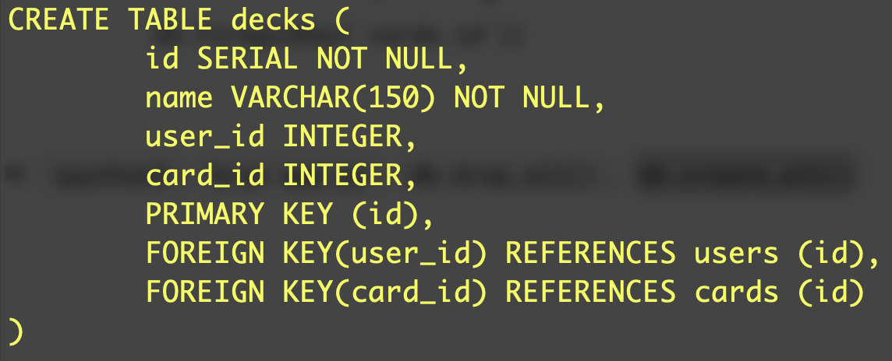

# Magic The Gathering Stats Dashboard
Scryfall API docs - https://scryfall.com/docs/api

### Creating a new Flask App

-   Create a new virtual environment in my directory  `python3 -m venv env`
-   Activate the virtual environment  `source env/bin/activate`
-   Install Flask  `pip3 install Flask`
-   Create  `flask/`  folder and  `app.py`  in there
-   Add boilerplate code
```
"""test Flask with this"""

from flask import Flask
app = Flask(__name__)

@app.route('/')
def hello():
    return 'Hello World!'
```

-   `cd flask`
-  `flask run`  to run this locally on localhost:5000

---

### Setting up git & GitHub
`git init`
`git status`
Create a `.gitignore` and include `__pycache__`
`git add .`
`git commit -m "Initial commit"`

Create a new repo on GitHub
`git remote add origin https://github.com/k-berryman/Magic-Dashboard.git`
`git remote -v`
`git push origin master`

---

### Add WTForms
(with help from  [these instructions](https://python-adv-web-apps.readthedocs.io/en/latest/flask_forms.html))

-   `pip3 install Flask-WTF`
-   `pip3 install flask-wtf`  just to double check
-   Create  `forms.py`
-   Add the following imports in  `forms.py`
```
from flask_wtf import FlaskForm
from wtforms import FloatField, StringField
```
-   Configuring our form with the following

```
class AddForm(FlaskForm):
    """Form"""

    name = StringField("Snack Name")
    price = FloatField("Price in USD")
```

-   In  `app.py`,  `from forms import AddForm`
-   Start by rendering the form to the user which can be submitted via POST req
-   In  `app.py`

```
@app.route('/')
def home():
    form = AddForm()
    return render_template("index.html", form=form)
```
- Create `templates/index.html`
- In `index.html`,
```
<body>
  <h1>My Form</h1>
  <form action="" method="POST">
    
      <p>
        {{ field.label }}
        {{ field }}
      </p>
    
    <button>Submit</button>
  </form>
</body>
```

- Update the route  `methods=["GET", "POST"]` in `app.py`

Now let's handle CSRF security
This part  `if field.widget.input_type != 'hidden'`  filters out CSRF Token in display

In `index.html` At the top of the form add `{{ form.hidden_tag() }} <!-- add type=hidden form fields -->` Make sure it's part of the form because we want it to be included in our POST req

Now we need to validate that token on the serverside. In  `app.py`,

```
@app.route('/form', methods=["GET", "POST"])
def form():
    form = AddForm()

    # if it's a post request with a valid CSRF Token
    if form.validate_on_submit():
        return redirect('/answer')

    else:
        return render_template("index.html", form=form)
```

Make sure to test with data for it to work properly

`validate_on_submit`  takes an empty form and fills it with data from the request

```
    # if it's a post request with a valid CSRF Token
    if form.validate_on_submit():
        name = form.name.data
        price = form.price.data
        print(name, price)
        return redirect('/answer')

```

Now we have the data!

Time to validate the data -- Throw friendly errors if it doesn't match ideal data format In  `forms.py`,  `from wtforms.validators import InputRequired, Optional, Email`

```
class AddForm(FlaskForm):
    """Form"""
    name = StringField(
      "Snack Name",
      validators=[InputRequired()])
    price = FloatField(
      "Price in USD",
      validators=[InputRequired()])
    quantity = FloatField(
      "Amount of Snack",
      validators=[InputRequired()])
```

`validate _on_submit` in `app.py` handles validating this

We want some error messages to render
In  `index.html`, in form,

```
      <p>
        {{ field.label }}
        {{ field }}

        {}
          {{err}}
        {}
      </p>
```

A secret key is required to use CSRF. In `app.py`,
```
# Flask-WTF requires an encryption key - the string can be anything
app.config['SECRET_KEY'] = 'TESTINGGG'
```

This is what `index.html` should contain
```
<!DOCTYPE html>
<html lang="en">
<head>
  <meta charset="UTF-8">
  <title>Form</title>
</head>
<body>
  <h1>My Form</h1>
  <form method="POST">
    {{ form.hidden_tag() }} <!-- add type=hidden form fields -->
    {{ form.csrf_token }}

    
      <p>
        {{ field.label }}
        {{ field }}

        
          {{ err }}
        
      </p>
    
    <button>Submit</button>
  </form>
</body>
</html>
```

Yay! WTForms is set up. Right now the values are from my last project, so we'll just update based on what input we need.

---

### External API Request
`pip3 install requests`
Add `jsonify` to imports

```
@app.route('/req')
def req():
    resp = requests.get("https://api.scryfall.com/cards/random")

    data = resp.json()

    # using the APIs JSON data, return that to browser
    return jsonify(data)
```

---

### Template Inheritance
-   Make  `templates`  folder and  `base.html`  in there and add this boilerplate

```
<!DOCTYPE html>
<html lang="en">
<head>
  <meta charset="UTF-8">
  <meta name="viewport" content="width=device-width, initial-scale=1.0">
  <meta http-equiv="X-UA-Compatible" content="ie=edge">
  <title>Document</title>
  <link rel="stylesheet" href="https://stackpath.bootstrapcdn.com/bootswatch/4.1.3/lumen/bootstrap.css">
</head>
<body>
  <div class="container">
    
    
  </div>
</body>
</html>
```

Create  `home.html`  with this boilerplate

```




<h1>Home Page</h1>
<h2>Hello, user!</h2>


```

In  `app.py`, import  `render_template`  and  `return render_template("home.html")`

---

### Creating Register Page
In `forms.py`,
```
class RegisterForm(FlaskForm):
    """Register Form"""

    name = StringField("Name",
        validators=[
            InputRequired("Name can't be blank"),
            Length(min=1, max=50, message="Name must be 50 characters or less")])

    email = StringField("Email",
        validators=[
            InputRequired("Email can't be blank"),
            Email("Please enter a valid email"),
            Length(min=1, max=50, message="Email must be 50 characters or less")])

    username = StringField("Username",
        validators=[
            InputRequired("Username can't be blank"),
            Length(min=1, max=25, message="Username must be 25 characters or less")])

    password = PasswordField("Password",
        validators=[
            InputRequired("Password can't be blank")])

```

Create view function in  `app.py`

```
@app.route('/register', methods=["GET", "POST"])
def register():
    form = RegisterForm()

    # if it's a request with a valid CSRF Token
    if form.validate_on_submit():
        # retrieve data from form
        name = form.name.data
        email = form.email.data
        username = form.username.data
        password = form.password.data

        # add to SQLAlchemy
        #user = User(username=username, password=password, email=email, first_name=first_name, last_name=last_name)
        #db.session.add(user)
        #db.session.commit()

        # redirect
        return redirect('/success')
    return render_template("register.html", form=form)
```

---

### Creating Login Page
In `forms.py`,
```
class LoginForm(FlaskForm):
    """Login Form"""

    username = StringField("Username",
        validators=[
            InputRequired("Username can't be blank"),
            Length(min=1, max=25, message="Username must be 25 characters or less")])

    password = PasswordField("Password",
        validators=[
            InputRequired("Password can't be blank")])
```
Create view function in  `app.py`
```
@app.route('/login', methods=["GET", "POST"])
def login():
    form = LoginForm()

    # if it's a request with a valid CSRF Token
    if form.validate_on_submit():
        # retrieve data from form
        username = form.username.data
        password = form.password.data

        # verification...?

        # redirect
        return redirect('/secret')

    else:
        return render_template("login.html", form=form)
```

---

### Hashing and Login - Creating the models
-   Create  `models.py`  and add some boilerplate code

```
from flask_sqlalchemy import SQLAlchemy

db = SQLAlchemy()

def connect_db(app):
    """Connect to database."""
    db.app = app db.init_app(app)

class User(db.Model):
    """User."""

    __tablename__ = "users"

    id = db.Column(db.Integer,
                   primary_key=True,
                   autoincrement=True)

    name = db.Column(db.String(150),
                     nullable=False)

    description = db.Column(db.String(300),
                     nullable=False)

```

-   Update the data to match the given schema



`pip3 install flask_sqlalchemy`
`pip3 install flask_bcrypt`

In `models.py`, `from flask_bcrypt import Bcrypt`
In `app.py`,
```
from models import connect_db, db, User
...

app.config['SQLALCHEMY_DATABASE_URI'] = 'postgresql:///magicDB'
app.config['SQLALCHEMY_TRACK_MODIFICATIONS'] = False
app.config['SQLALCHEMY_ECHO'] = True

connect_db(app)
```

In terminal, `createdb magicDB`  
`ipython3`  
`%run app.py`  
`db.create_all()`



`psql`  
`\c magicDB`  
`SELECT * FROM users;`
`SELECT * FROM cards;`



Add a `register` class method to User model in `models.py`
```
    @classmethod
    def register(cls, name, email, username, password):
        """Register user w/ hashed password & return user."""

        hashed = bcrypt.generate_password_hash(password)

        # turn bytestring into normal unicode utf8 string
        hashed_utf8 = hashed.decode("utf8")

        # return instance of user w/ username and hashed password
        return cls(name=name, email=email, username=username, password=hashed_utf8)
```

`ipython3`, `%run app.py`, `user1 = User.register(sample data)`, `user1.username`, `user1.password`
It works!


---

Authenticate class method on User model
```
@classmethod
def authenticate(cls, username, password):
    """Validate that user exists and password is correct. Return user if valid; else, return False """

    u = User.query.filter_by(username=username).first()
    if u and bcrypt.check_password_hash(u.password, password):
        return u
    else:
        return False
```

`pip3 install psycopg2`

View function for login
```
@app.route('/login', methods=["GET", "POST"])
def login():
    form = LoginForm()

    # if it's a request with a valid CSRF Token
    if form.validate_on_submit():
        # retrieve data from form
        username = form.username.data
        password = form.password.data

        # verification
        user = User.authenticate(username, password)

        if user:
            return redirect('/secret')
        else:
            form.username.errors = ['Invalid username/password']

    else:
        return render_template("login.html", form=form)
```

View function for register
```
@app.route('/register', methods=["GET", "POST"])
def register():
    form = RegisterForm()

    # if it's a request with a valid CSRF Token
    if form.validate_on_submit():
        # retrieve data from form
        name = form.name.data
        email = form.email.data
        username = form.username.data
        password = form.password.data

        # add to SQLAlchemy
        newUser = User.register(name, email, username, password)
        db.session.add(newUser)
        db.session.commit()

        # redirect
        flash('Welcome! Successfully logged in')
        return redirect('/secret')

    return render_template("register.html", form=form)
```

---

### Hashing and Login - Authentication
Now we have password hashing, but anyone can navigate to `/secret`. Let’s protect this route and make sure that only users who have logged in can access this route.

After login or registering, store their username in the session.

import session

In `register` view func before redirecting,
```
# add new user's username to session
session['sessionUsername'] = newUser.username
```

In `login` view func before redirecting,
```
# add user_id to session
session['sessionUsername'] = user.username
```

Make the `/secret` route
```
@app.route('/secret')
def secret():
    if "sessionUsername" not in session:
        flash('Please login first!')
        return redirect('/')

    return "You made it!"
```

---

### Hashing and Login - Logging Out
Make a new route. Clear any information from the session and redirect to /
```
@app.route('/logout')
def logout():
    session.pop('sessionUsername')
    flash('Goodbye! Logging out now..')
    return redirect('/')
```

Could make this a post request by styling an empty form on top of UI Logout. Post req is best practice, but this is the Springboard taught us.

---

### Hashing and Login - Authorization
Let’s add some authorization! When a user logs in, take them to `GET /users/<username>`

Display a template the shows information about that user (everything except for their password). You should ensure that only logged in users can access this page.

> Change secrets route name   
> Make dashboard.html   
> Pass user into dashboard.html
> Change references from '/secret'

---

Let's add some styling

# ADD MORE HERE
---

Many-to-Many

```
class Deck(db.Model):
    """Deck."""

    __tablename__ = "decks"

    id = db.Column(db.Integer,
        primary_key=True,
        autoincrement=True)

    name = db.Column(db.String(150),
        nullable=False)

    user_id = db.Column(db.Integer,
        db.ForeginKey('users.id'))

    card_id = db.Column(db.Integer,
        db.ForeginKey('cards.id'))
```

`ipython3`, `%run app.py`, `db.drop_all()`, `db.create_all()`





Still in `ipython3`,
```
user = User(name="Kaitlin Berryman", email="kaitlinberryman@gmail.com", username="GolgariGal", password="Simic123")
db.session.add(user)
db.session.commit()

card = Card(name="Terastodon", picture="https://gatherer.wizards.com/Handlers/Image.ashx?multiverseid=197137&type=card", cmc="8", price=3.13, colors="g")
db.session.add(card)
db.session.commit()

deck_card = Deck(name="Aesi", user_id=1, card_id=1)
db.session.add(deck_card)
db.session.commit()
```
